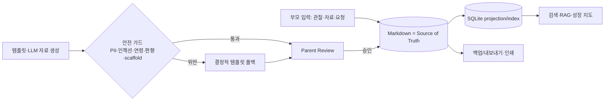

<p align="center">
  
</p>

<p align="center">
  <strong>아이의 성장을 기록하고, 부모의 교육 철학에 맞춰 학습 자료를 만든다.</strong><br>
  Local-first, parent-centered child learning tracking, knowledge organization, and material generation.
</p>

<p align="center">
  <a href="https://github.com/JDeun/growwise/actions/workflows/ci.yml"></a>
  <a href="https://github.com/JDeun/growwise/actions/workflows/package.yml"></a>
  <a href="https://github.com/JDeun/growwise/actions/workflows/secret-scan.yml"></a>
  <a href="LICENSE"></a>
  
</p>

> [!IMPORTANT]
> **현재 상태: pre-1.0 / 활발한 구현.** 소스와 CI 기반 unsigned 데스크탑 빌드는 사용할 수 있으나,
> code signing/notarization을 거친 **공식 signed public release는 아직 없습니다.** GrowWise는 발달
> **진단·평가 도구가 아니며**, 생성물은 반드시 Parent Review 승인 후에만 사용합니다.

> [!NOTE]
> **로컬·프라이버시 원칙:** 아동 데이터는 로컬에서 처리하고(Markdown = Source of Truth, SQLite =
> 재생성 인덱스), 아이 대면 챗봇은 범위 밖입니다. 공개 저장소에는 실명·생년 등 개인정보를 커밋하지
> 않으며, 저장소 PII 감사 테스트로 이를 강제합니다.

GrowWise는 챗봇 제품이 아니다. 핵심은 부모의 교육 철학에 맞춰 **아이의 성장과 학습을
장기적으로 기록·정리·추적하고, 관련 자료를 수집·검색·정리하며, 필요한 학습 자료를 만드는
개인용 교육 관리 도구**다.

LLM은 화면의 주인공이 아니라 **백그라운드 엔진**이다. 사용자는 자연어로 "최근 수학 활동
중 측정 관련 기록 찾아줘", "지난 한 달 동안 탐구 활동이 적었던 이유를 정리해줘", "이 책과
아이의 현재 관심사를 바탕으로 활동지 만들어줘"처럼 요청할 수 있지만, 제품의 본질은 대화가
아니라 **데이터·기록·자료·워크플로우를 관리하는 것**이다.

개인이 운영하는 홈스쿨링용 크로스플랫폼 데스크탑 앱(Windows·macOS, Tauri)으로 시작하며,
오프라인 우선으로 설계한다. 대상은 **0세부터 고등학교까지**다. 첫 실사용 도메인은 현재
생후 9개월 아이에게 실제로 사용할 수 있는 **영아(0~2세) 모드**이며, 이후 유아·초등 자료
생성, 중·고 학습 트래킹까지 확장한다.

> **모토:** AI가 아이를 대신해 가르치는 것이 아니라, 부모가 자신의 교육 철학에 따라
> 아이를 이해하고 돕기 위해 필요한 기록·자료·맥락을 관리하도록 돕는다.

---

## GrowWise가 하는 일

| | 기능 | 설명 |
|---|---|---|
| 📝 | **교육 트래킹** | 활동·관심사·반응·어려움·질문·회고를 장기 기록 |
| 🌱 | **성장/경험 지도** | 점수·등수 대신 아이 자신의 시간 흐름 안에서 경험 커버리지를 추적 |
| 📚 | **자료 수집·정리** | 책·교육과정·활동 자료·외부 데이터를 provenance와 함께 관리 |
| 🔍 | **자연어 검색/질의** | 저장된 기록·자료를 자연어로 찾고 요약·비교·답변 |
| ✏️ | **학습자료 생성** | 독서·영어·탐방·수학·과학·글쓰기 등 자료를 안전 가드와 함께 생성 |
| 🧭 | **활동 관리** | 부모가 선택하는 퀘스트/활동 계획과 완료 기록 |
| ✅ | **부모 검토** | 생성물은 난이도·민감성·개인정보·scaffold 검토 후 승인 |
| 💾 | **장기 보존** | Markdown SoT + SQLite projection으로 소유권과 검색 성능을 함께 확보 |

## 데이터 흐름 한눈에 보기



*LLM/embedding 장애 시에도 CRUD·검색·트래킹·템플릿 생성은 계속 동작한다(LLM-enhanced, not LLM-dependent).*

## LLM의 역할

LLM은 적극적인 대화 상대가 아니라 다음 백그라운드 작업을 수행한다.

1. 기록과 자료의 분류·태깅·요약
2. 자연어 검색 의도 해석과 RAG 질의
3. 여러 기록 사이의 연결과 맥락 정리
4. 교육과정/자료를 바탕으로 학습 자료 생성
5. 다음 활동 후보 생성
6. 생성물의 구조·안전·grounding 검토 보조
7. 부모가 요청한 질문에 저장된 근거를 바탕으로 답변

아이가 앱 안에서 LLM과 계속 대화하는 챗봇 UX는 범위 밖이다. 그런 역할은 ChatGPT,
Claude 같은 범용 상용 LLM이 이미 잘 수행한다. GrowWise는 **가족 교육 데이터와 워크플로우에
특화된 시스템**에 집중한다.

## LLM 없이도 동작한다

GrowWise는 **LLM-enhanced이지 LLM-dependent가 아니다.** 로컬 모델이 설치되지 않았거나
Ollama가 중단되어도 다음 핵심 기능은 계속 사용할 수 있어야 한다.

- 아이 프로필과 기록 CRUD
- Markdown SoT / SQLite projection
- 자료 지식베이스와 lexical 검색
- 경험 축 기반 성장 지도
- 활동/자료 상태 관리
- 대화 세션 저장
- Parent Review
- deterministic 자료 템플릿과 영아 활동 fallback

LLM과 embedding은 자동 태깅, semantic retrieval, 질의 재작성, grounded synthesis, 개인화
생성 같은 **보강 기능**으로만 동작한다. 각 AI 경로에는 deterministic fallback을 둔다.

## 무엇이 아닌가

- 아이를 대신해 답을 주는 자율 튜터가 아니다.
- ChatGPT/Claude를 복제한 범용 챗봇이 아니다.
- 아이를 점수화·서열화하는 평가 시스템이 아니다.
- 발달 진단 도구가 아니다.
- 완전한 홈스쿨링 대체재가 아니다.

## 핵심 원칙

1. **부모 중심** — AI가 아니라 부모의 판단과 교육 철학이 최종 기준이다.
2. **기록 중심** — 생성물보다 장기적으로 누적되는 학습·관찰 맥락이 중요하다.
3. **로컬 우선** — 아동 데이터는 가능한 로컬에서 처리한다.
4. **근거 기반** — 검색·답변·생성에는 provenance와 출처를 남긴다.
5. **비점수화** — 성장 지도는 성취 점수 대신 경험/관찰 커버리지를 표현한다.
6. **검토 후 노출** — 생성 자료는 Parent Review 승인 후 사용한다.
7. **모델 독립성** — LangChain + LangGraph 기반으로 로컬/원격 모델을 교체 가능하게 한다.
8. **LLM 비의존성** — AI 장애가 핵심 데이터/관리 기능 장애로 전파되지 않는다.
9. **완성형 목표** — 작은 MVP에서 멈추지 않고 전 연령·전 기능 완성을 목표로 한다.

## 기술 방향

- Desktop: Tauri 2 + React/TypeScript
- Core: Python 3.12+ / FastAPI sidecar
- Desktop IPC: React → typed Tauri commands → Rust → localhost Core
- Orchestration: **LangChain + LangGraph**
- Workflow persistence: LangGraph `SqliteSaver` + `workflow_run`
- Storage: Markdown(Source of Truth) + SQLite projection/index
- Model: local-first provider abstraction, 현재 Ollama adapter
- RAG: lexical + optional embedding hybrid retrieval
- Background jobs: SQLite durable job queue
- Desktop packaging: PyInstaller one-file Core bundled as Tauri resource
- Export: 이식형 백업(zip)·Markdown 묶음 + 승인 자료 WebView/OS 네이티브 인쇄·PDF
- Platforms: Windows + macOS

자세한 실행 구조는 [docs/architecture.md](docs/architecture.md)를 참고한다.

## 현재 구현 상태

**pre-1.0 / 활발한 구현 단계.** 설계 전용 저장소를 지나, local-first Core와 데스크탑 앱의
대부분 기능이 구현·테스트된 상태다([로드맵](docs/roadmap.md) 체크리스트 대부분 완료). 저장소
내부 기능 구현과 안전·패키징 자동화는 운영 검증을 제외하고 완료 상태이며, 남은 것은 실제
code signing/notarization 자격증명, updater 장기 trust key 운영, 실기기·로컬모델 benchmark
실측, 가정 dogfooding이다.

현재 구현된 기반:

- Python 3.12 package / FastAPI local Core
- Pydantic domain model + UUIDv7
- `ChildProfile`, `LearningLog`, `ActivityPlan`, `ResourceRecord`, `GeneratedMaterial`, `WorkflowRun`
- Markdown atomic Source-of-Truth repository
- SQLite disposable projection + deterministic Markdown rebuild
- frontmatter 예약 키 codec과 rebuild 회귀 테스트
- child-scoped lexical retrieval
- Resource chunking / hybrid RAG index / optional Ollama embedding
- 저장 기록 + Resource KB 통합 child context 질의
- 자연어 검색 plan 생성 + deterministic fallback
- bounded multi-turn conversation session + SQLite persistence
- LangChain ModelProvider abstraction + Ollama `ChatOllama` adapter
- 관찰 원문을 보존하는 선택적 LLM 태깅·메타데이터 보강
- LangGraph observation workflow + SQLite durable checkpoint + `thread_id`
- workflow 실행 상태/출력 참조 저장
- SQLite durable background job queue
- 영아 활동 추천 + deterministic fallback
- 경험 축 기반 deterministic 성장 지도
- template-first 자료 생성 + optional LLM enhancement
- Parent Review 상태 머신
- Tauri 2 + React/TypeScript desktop shell
- Tauri IPC를 통한 Core health / profile create / growth-map 조회
- Rust `CoreProcessManager`: 개발 Core 자동 기동·소유 프로세스 종료
- PyInstaller one-file Core sidecar build + Tauri resource packaging 경로
- Windows/macOS/Linux Python CI, React build, Rust `cargo check`, packaged-Core smoke test
- GrowWise brand SVG assets
- 이식형 백업 export/import + Markdown 묶음 아카이브(경로 traversal 방어)
- 불변 부모본 자료 편집·버저닝(동시 생성 직렬화)
- 중·고 학습 트래킹
- 콘텐츠 안전 가드 — PII·프롬프트 인젝션·연령 부적합·고정관념·scaffold(정답 대신 힌트) + 적대적 회귀 테스트
- 모델 아티팩트 무결성 검증 레지스트리(sha256·원자적 쓰기)
- 안전한 저장소 위치 이전(복사·검증·스왑, 데이터 무손실)
- 접근성(ARIA·역할·키보드 내비게이션·포커스 트랩) + 안전한 자료 출력 렌더러(테이블/도형, 미신뢰 HTML 이스케이프)
- 의존성 라이선스 기반 THIRD_PARTY_NOTICES 자동생성 + 저장소 PII 감사 테스트

## 로컬 코어 실행

```bash
python -m pip install -e ".[dev]"
growwise
```

기본 API 주소:

```text
http://127.0.0.1:8765
```

주요 환경변수:

```bash
GROWWISE_DATA_DIR=~/.growwise
GROWWISE_MODEL_PROVIDER=ollama
GROWWISE_MODEL_ID=qwen3.5:9b
GROWWISE_MODEL_BASE_URL=http://127.0.0.1:11434
GROWWISE_LLM_FEATURES_ENABLED=true
GROWWISE_EMBEDDING_FEATURES_ENABLED=true
```

AI 기능을 완전히 끄려면:

```bash
GROWWISE_LLM_FEATURES_ENABLED=false
GROWWISE_EMBEDDING_FEATURES_ENABLED=false
```

## Desktop 개발 실행

먼저 Python 개발 환경에 GrowWise를 설치한 뒤:

```bash
python -m pip install -e ".[dev]"
cd desktop
npm install
npm run tauri:dev
```

Tauri가 `127.0.0.1:8765`에서 기존 Core를 발견하지 못하면 개발 환경의 Python으로
`growwise.api.main`을 자동 기동한다. 앱 종료 시 GrowWise가 직접 시작한 Core만 종료한다.

## Desktop Core sidecar 빌드

사용자 PC에 Python 설치를 요구하지 않도록 release 앱은 독립 실행 Core를 bundle resource로
포함한다.

```bash
python -m pip install -e ".[desktop-build]"
python desktop/scripts/build_core_sidecar.py
```

결과는 플랫폼에 따라 다음 위치에 생성된다.

```text
desktop/src-tauri/binaries/growwise-core
desktop/src-tauri/binaries/growwise-core.exe
```

실행 파일은 Git에 커밋하지 않고 CI/릴리스 과정에서 플랫폼별로 생성한다.

현재 주요 API vertical slices:

```text
POST /v1/children
POST /v1/observations
GET  /v1/children/{child_id}/observations
GET  /v1/children/{child_id}/search?q=...
GET  /v1/children/{child_id}/growth-map
GET  /v1/children/{child_id}/infant-activities
POST /v1/resources
POST /v1/rag/ask
POST /v1/children/{child_id}/ask
POST /v1/children/{child_id}/conversations
POST /v1/conversations/{session_id}/turns
POST /v1/children/{child_id}/materials
POST /v1/materials/{material_id}/review
GET  /health
```

## 문서

| 문서 | 내용 |
| --- | --- |
| **[docs/pedagogy.md](docs/pedagogy.md)** | **교육 원칙과 사상 — 제품의 중심** |
| [docs/vision.md](docs/vision.md) | 제품 비전·LLM 역할·성공 기준 |
| [docs/product-spec.md](docs/product-spec.md) | 전 연령 제품 사양·트래킹·자료·검색·생성 |
| [docs/material-product-ux.md](docs/material-product-ux.md) | 자료 생성·검토 제품 UX |
| [docs/architecture.md](docs/architecture.md) | Tauri/Python/LangChain/LangGraph 실행 구조 |
| [docs/data-model.md](docs/data-model.md) | Markdown SoT·SQLite projection·상태 머신 |
| [docs/integrations.md](docs/integrations.md) | 외부 API·데이터 소스·Model Provider |
| [docs/privacy-and-safety.md](docs/privacy-and-safety.md) | 프라이버시·비감시·비진단·해석 안전성 |
| [docs/threat-model.md](docs/threat-model.md) | 위협 모델·데이터 보존/삭제 |
| [docs/evaluation.md](docs/evaluation.md) | 생성/RAG/장기해석/발달 안전 평가 하니스 |
| [docs/attribution.md](docs/attribution.md) | 라이선스·provenance·NOTICE |
| [docs/curriculum-sources.md](docs/curriculum-sources.md) | 교육과정·과목별 공개 자료 후보 |
| [docs/design-system.md](docs/design-system.md) | 브랜드·UI·성장지도·자연어 검색 디자인 규칙 |
| [docs/hardware.md](docs/hardware.md) | 최소/권장 하드웨어 |
| [docs/references.md](docs/references.md) | 참고 자료·근거 |
| [docs/release.md](docs/release.md) | 릴리스·패키징 절차 |
| [docs/operational-validation.md](docs/operational-validation.md) | 실기기 benchmark·서명·updater 운영 검증 절차 |
| [docs/roadmap.md](docs/roadmap.md) | 전체 기능 완성 로드맵 |

브랜드 자산은 [assets/brand](assets/brand)를 참고한다.

## 라이선스

[Apache License 2.0](LICENSE). Copyright 2026 Yong-eun Cho.
